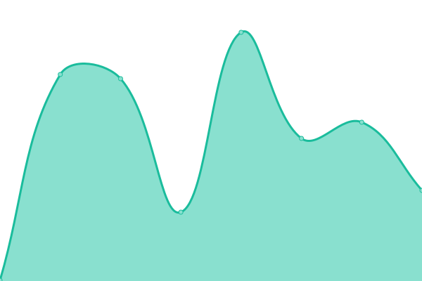

# [📈 Live Status](https://www.clouderg.com): <!--live status--> **🟧 Partial outage**

This repository contains the open-source uptime monitor and status page for [CloudErg](clouderg.com), powered by [Upptime](https://github.com/upptime/upptime).

With [Upptime](https://upptime.js.org), you can get your own unlimited and free uptime monitor and status page, powered entirely by a GitHub repository. We use [Issues](https://github.com/clouderg-inc/uptime/issues) as incident reports, [Actions](https://github.com/clouderg-inc/uptime/actions) as uptime monitors, and [Pages](https://www.clouderg.com) for the status page.

<!--start: status pages-->
<!-- This summary is generated by Upptime (https://github.com/upptime/upptime) -->
<!-- Do not edit this manually, your changes will be overwritten -->
<!-- prettier-ignore -->
| URL | Status | History | Response Time | Uptime |
| --- | ------ | ------- | ------------- | ------ |
|  [www.clouderg.com](https://www.clouderg.com) | 🟥 Down | [www-clouderg-com.yml](https://github.com/clouderg-inc/uptime/commits/HEAD/history/www-clouderg-com.yml) | 

 0ms
     
 | 

<a href="https://www.clouderg.com/history/www-clouderg-com">0.00%</a>
    

|  [smtp.clouderg.com](https://smtp.clouderg.com) | 🟩 Up | [smtp-clouderg-com.yml](https://github.com/clouderg-inc/uptime/commits/HEAD/history/smtp-clouderg-com.yml) | 

 401ms
     
 | 

<a href="https://www.clouderg.com/history/smtp-clouderg-com">100.00%</a>
    

|  [smtp2.clouderg.com](https://smtp2.clouderg.com) | 🟩 Up | [smtp2-clouderg-com.yml](https://github.com/clouderg-inc/uptime/commits/HEAD/history/smtp2-clouderg-com.yml) | 

 247ms
     
 | 

<a href="https://www.clouderg.com/history/smtp2-clouderg-com">100.00%</a>
    

|  [genesis.clouderg.com](https://genesis.clouderg.com) | 🟥 Down | [genesis-clouderg-com.yml](https://github.com/clouderg-inc/uptime/commits/HEAD/history/genesis-clouderg-com.yml) | 

 0ms
     
 | 

<a href="https://www.clouderg.com/history/genesis-clouderg-com">0.00%</a>
    

<!--end: status pages-->

[**Visit our status website →**](https://www.clouderg.com)

## 📄 License

- Powered by: [Upptime](https://github.com/upptime/upptime)
- Code: [MIT](./LICENSE) © [CloudErg](clouderg.com)
- Data in the `./history` directory: [Open Database License](https://opendatacommons.org/licenses/odbl/1-0/)
